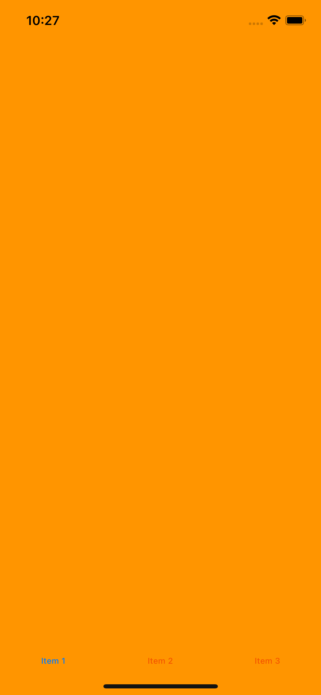
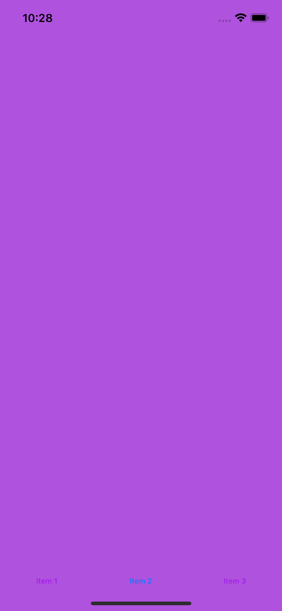
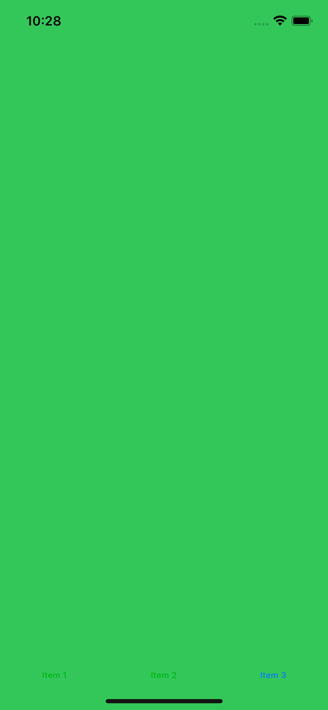

# TabBar

Приложение для навигации между экранами с использованием Tab Bar Controller в iOS, написанное на Swift с использованием UIKit.

Описание

Это приложение использует Tab Bar Controller для навигации между несколькими экранами. Каждый экран представляет собой отдельный UIViewController, и пользователь может переключаться между ними с помощью стандартной панели вкладок внизу экрана. Это демонстрация простого использования UITabBarController для создания приложения с несколькими вкладками.

Технологии

	•	Swift
	•	UIKit
	•	Xcode

Возможности

	•	Переходы между экранами с использованием Tab Bar Controller.
	•	Возможность отображать разные экраны, каждый из которых имеет собственный контент.
	•	Пример использования UIViewController и UITabBarController для упрощенной навигации между экранами.

Скриншоты

Если у вас есть скриншоты, добавьте их в репозиторий, а затем вставьте ссылки на них в README:

## Скриншоты

Установка

	1.	Склонируйте репозиторий:

git clone https://github.com/DanilaRuzh/TabBarNavigation.git

	2.	Откройте проект в Xcode.
	3.	Запустите на симуляторе или устройстве.

Контакты

Автор: DanilaRuzh
GitHub: https://github.com/DanilaRuzh
